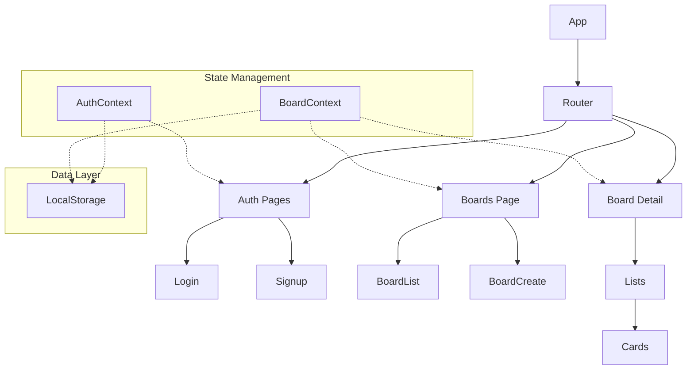
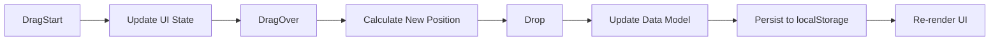
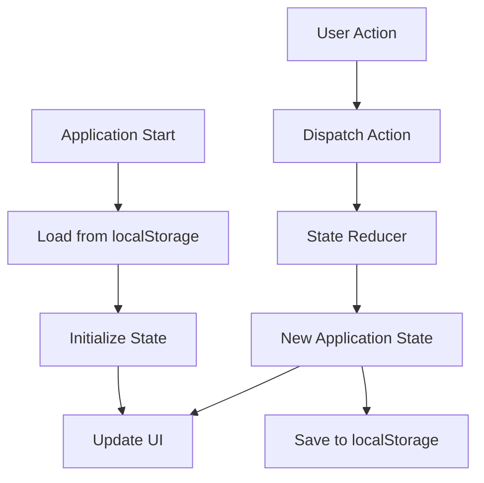

# System Patterns: Trello Clone

## Application Architecture


## Component Hierarchy
- **App**: Root component, contains routing and global providers
  - **AuthProvider**: Context provider for authentication state
  - **BoardProvider**: Context provider for board data
  - **ThemeProvider**: For light/dark mode support
  - **Router**: Handles application routing
    - **Auth Pages**: Login, Signup, Password Reset
    - **Dashboard**: Home screen with board overview
    - **BoardDetail**: Individual board with lists and cards
      - **Lists**: Container for multiple lists
        - **List**: Individual list component
          - **Cards**: Container for multiple cards
            - **Card**: Individual card component
            - **CardDetail**: Modal for expanded card information

## Data Models
```typescript
// User Model
interface User {
  id: string;
  username: string;
  email: string;
  avatarUrl?: string;
}

// Board Model
interface Board {
  id: string;
  title: string;
  description?: string;
  backgroundColor?: string;
  createdAt: number;
  updatedAt: number;
  createdBy: string; // User ID
}

// List Model
interface List {
  id: string;
  boardId: string;
  title: string;
  position: number;
  createdAt: number;
  updatedAt: number;
}

// Card Model
interface Card {
  id: string;
  listId: string;
  title: string;
  description?: string;
  position: number;
  labels?: Label[];
  createdAt: number;
  updatedAt: number;
}

// Label Model
interface Label {
  id: string;
  name?: string;
  color: string;
}
```

## Key Design Patterns

### 1. Composite Pattern
The UI structure follows a composite pattern where boards contain lists, which contain cards - each level can be manipulated independently.

### 2. Observer Pattern
React's Context API implements an observer pattern where component re-renders are triggered by state changes.

### 3. Singleton Pattern
Global state managers (Context API) serve as singletons providing a single source of truth.

### 4. Command Pattern
User actions trigger state changes through dispatched actions, similar to a command pattern.

### 5. Facade Pattern
Service layers will abstract the complexity of localStorage operations.

## Key Technical Solutions

### Drag and Drop Implementation


### Data Persistence Strategy


## Code Organization
```
src/
├── assets/           # Static assets like images, icons
├── components/       # Reusable UI components
│   ├── auth/         # Authentication related components
│   ├── board/        # Board related components
│   ├── list/         # List related components
│   ├── card/         # Card related components
│   └── ui/           # Generic UI components
├── context/          # React context providers
├── hooks/            # Custom React hooks
├── pages/            # Route components/pages
├── services/         # Service layer for API/data access
├── utils/            # Utility functions and helpers
└── App.js            # Main application component
```
